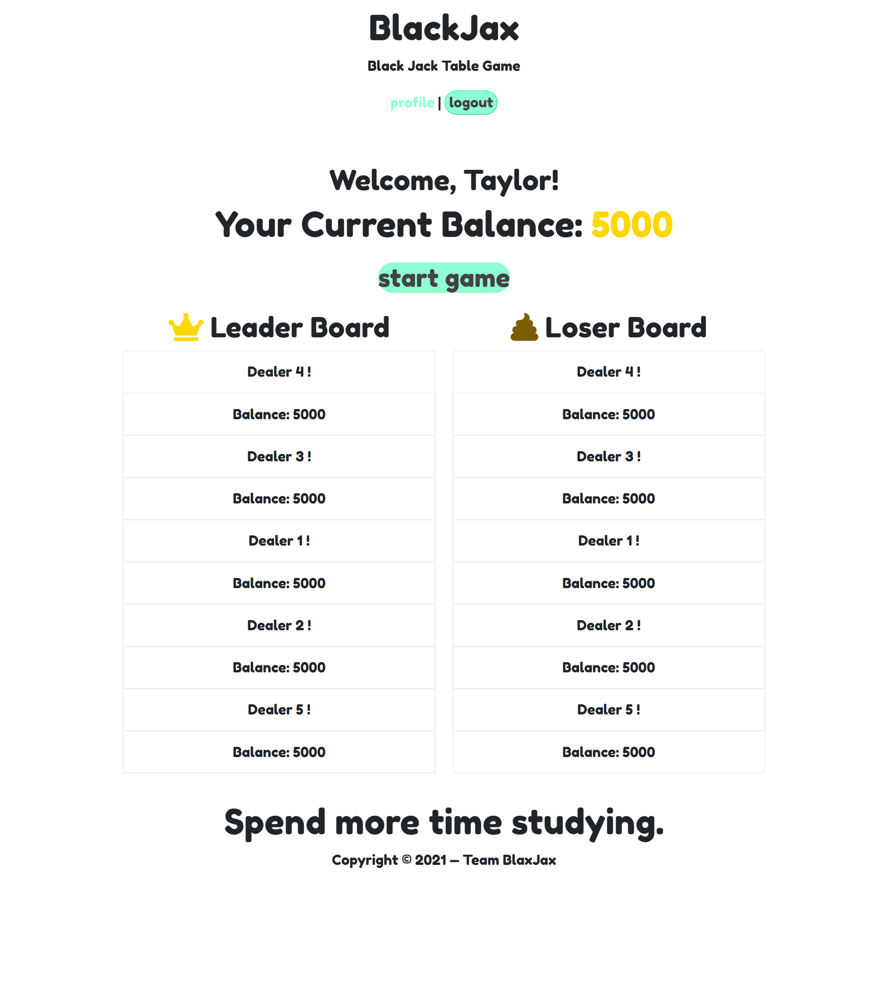

<h1 align="center">BLAXJAX - BLACKJACK PROJECT👋</h1>
    

    
    
    
    
    
    
    
    

## Table of Contents
- [Description](#description)
- [User Story](#user-story)
- [Acceptance Criteria](#acceptance-criteria)
- [Table of Contents](#table-of-contents)
- [Installation](#installation)
- [Usage](#usage)
- [Contributing](#contributing)
- [Questions](#questions)
   
## Description

This is a simple Blackjack app that enables a user to set up a profile and login under that profile to play blackjack.  The user will compete against the dealer, and will be ranked against prior players.  It utilizes MYSQL
  
## User Story
  
AS A USER,
I WANT TO be able to login to my profile to play Blackjack
SO THAT I can try my luck against the dealer.
IT’S DONE when I play Blackjack, win, lose or draw.
  
## Acceptance Criteria

GIVEN a functional Express.js API
WHEN I create a profile
THEN I am able to login to the profile page
WHEN I select the option to start a new game
THEN I am taken to the blackjack game page
WHEN I am presented with two cards
THEN I can decide whether to hit or stay
WHEN I hit, an additional card is provided to me
THEN if the card value is not greater than 21 I will have the option to hit or stay again, but if the value is over 21 I will bust and lose the game
WHEN I have a final card score of less than 21 but greater than the dealer
THEN I win the round

## Installations
Before starting, please have Node.js and npm installed on your computer. Then clone the repo. Add a .env file to your root directory. Fill out the .env file with your information as so:

DB_NAME=blackjack_db
DB_USER=
DB_PW=

Install the dependencies by opening the integrated terminal in your root termainal and entering: 

npm i 

Run the seed that is located in seeds/seeds.js:

npm run seed

Then connect to the server:

## Usage
💻   

## Contributing
: [Byungwook Yoon (Ethan)](https://github.com/byung90/)
: [Dwyane (Shangxian) Piao](https://github.com/sj212131)
: [Taylor Leong](https://github.com/tjl2125/)
: [Phil Katz](https://github.com/PKatz1/)

## Questions
✉️ Contact us with any questions: 

[Ethan email](mailto:....com) , [GitHub](https://github.com/byung90/) 

[Dwayne email](mailto:....com) , [GitHub](https://github.com/sj212131) 

[Taylor email](mailto:....com) , [GitHub](https://github.com/tjl2125/) 

[Phil email](mailto:pkatz@finkkatz.com), [GitHub](https://github.com/PKatz1/)

### Demo

### Made with:
- <a href = "https://getbootstrap.com/docs/4.6/getting-started/introduction/">Bootstrap CSS Framework</a>
- <a href = "https://handlebarsjs.com/installation/">Handlebars.js </a>
- <a href = "https://www.npmjs.com/package/bcrypt">Bcrypt Library </a>
- <a href = "https://www.npmjs.com/package/dotenv">Dotenv Library</a>
- <a href = "https://www.npmjs.com/package/mysql2">MySQL2 Library</a>
- <a href = "https://sequelize.org/">Sequelize Library</a>
- <a href = "https://www.npmjs.com/package/express"> Express Library </a>
- <a href = "https://www.npmjs.com/package/express-session">Express-Session Library </a> 
- <a href = "https://www.npmjs.com/package/express-handlebars">Express-handlebars </a>
- <a href = "https://www.npmjs.com/package/connect-session-sequelize"> Connect-Session-Sequelize Library</a>
- <a href = "https://www.npmjs.com/package/blackjack-strategy">BlackJack-Strategy Library</a>

Copyright (c) [2021] [Byungwook (Ethan) Yoon, Shangxian (Dwayne) Piao, Taylor Leong, Philip Katz]
